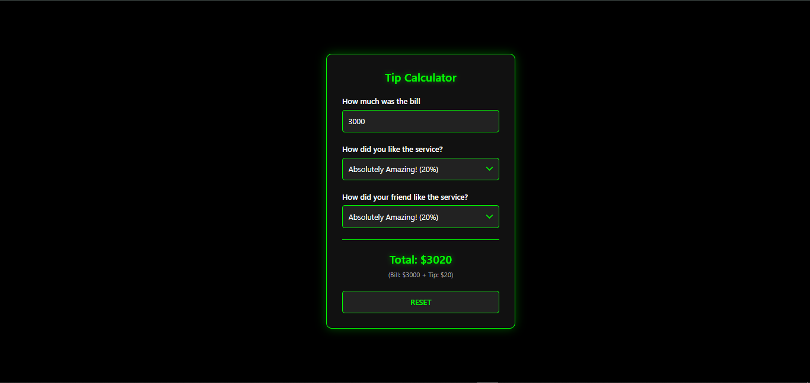

# tip-calculator

This is a simple Tip Calculator application built with React and Vite. The application allows users to calculate the total bill including tips based on their service satisfaction and their friend's service satisfaction.


# Live Site


## Features

- **Bill Input**: Enter the total bill amount.
- **Service Rating**: Select a rating for the service received.
- **Friend's Service Rating**: Select a rating for the service received by a friend.
- **Result Display**: View the total amount including the calculated tip.
- **Reset Button**: Reset all inputs to their default values.

## How to Use

1. **Enter the Bill Amount**:

   - In the "How much was the bill" input field, enter the total amount of the bill.

2. **Rate the Service**:

   - In the "How did you like the service?" dropdown, select a rating that reflects your satisfaction with the service.

3. **Rate Your Friend's Service**:

   - In the "How did your friend like the service?" dropdown, select a rating that reflects your friend's satisfaction with the service.

4. **View the Result**:

   - The total amount including the calculated tip will be displayed in the "Total" section. The breakdown of the bill and tip will also be shown.

5. **Reset the Calculator**:
   - Click the "RESET" button to clear all inputs and start over.

## Technologies Used

- React: A JavaScript library for building user interfaces.
- Vite: A build tool that aims to provide a faster and leaner development experience for modern web projects.
- CSS: For styling the application.
- JavaScript (ES6+): The programming language used for the application logic.

## Setup

1. **Clone the repository:**

   ```bash
   git clone https://github.com/Hallowdread/tip-calculator.git
   cd tip-calculator
   ```

2. **Install dependencies:**

   ```bash
   npm install
   ```

3. **Start the development server:**

   ```bash
   npm run dev
   ```

4. **Build the project for production:**

   ```bash
   npm run build
   ```

5. **Preview the production build:**
   ```bash
   npm run preview
   ```

## File Structure

```arduino
tip-calculator/
├── node_modules/
├── public/
│   └── vite.svg
├── src/
│   ├── componenets/
|   |   ├── Bill.jsx
|   |   ├── ResetBtn.jsx
|   |   ├── Result.jsx
|   |   └── Service.jsx
|   |
│   ├── App.jsx
│   ├── index.css
│   └── main.jsx
│
├── .gitignore
├── .eslint.config.js
├── index.html
├── package-lock.json
├── package.json
├── README.md
├── tip-calculator-img.PNG
└── vite.config.js
```

## Contributing

Contributions are welcome! Please feel free to submit a Pull Request.
